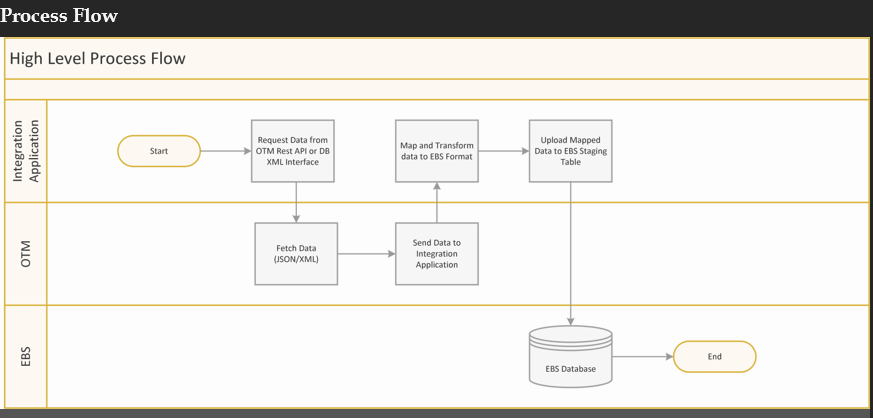
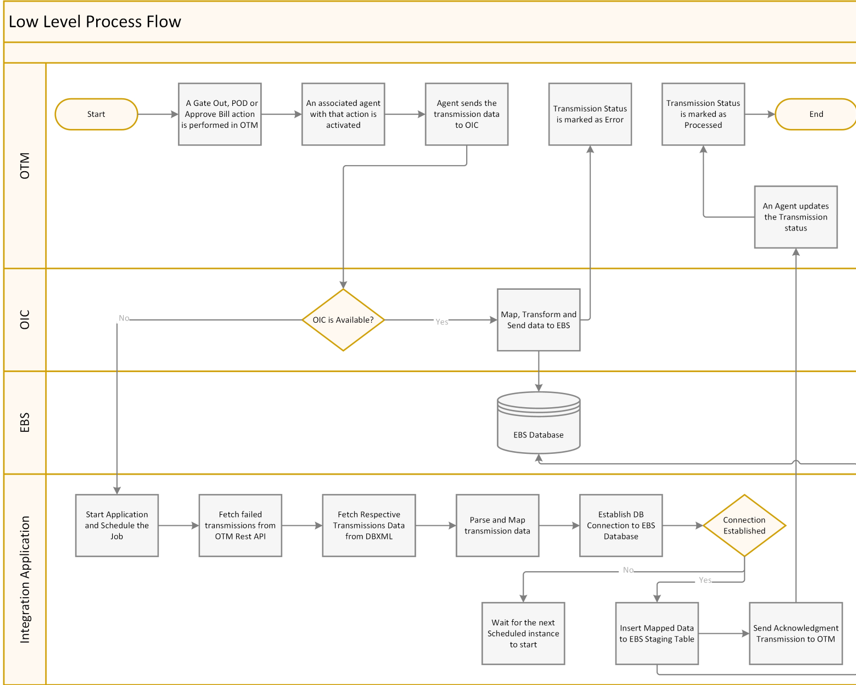

# OTM-EBS-Integration

This project integrates shipment data from the Oracle E-Business Suite (on-premises) with the Oracle Transportation Management (OTM) Cloud application, streamlining data flow and enhancing logistics management.

